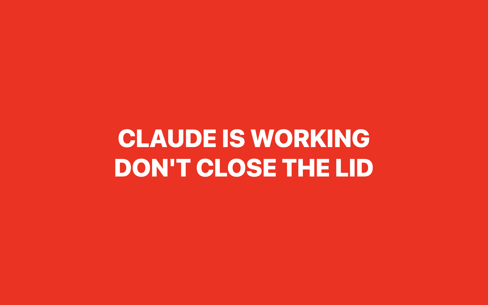

# OpenLid



**Don't close the laptop on Claude mid-thought.**

You kick off a task, wander off, and reflexively shut the lid — killing the run.
OpenLid stops you: start closing the lid while Claude Code is working and your
screen goes **full-screen red** and the laptop **yells at you**. Claude idle?
Close away, total silence.

It's `submit → armed`, `done → safe`. That's the whole product.

## Requirements

A MacBook with a lid angle sensor — **14"/16" MacBook Pro, or MacBook Air M2
(2022) and newer**. The M1 Air/Pro don't have it, so OpenLid can't help there.

## Install

```bash
git clone https://github.com/gergomiklos/openlid.git
cd openlid
./install.sh
```

That builds it, starts it at login, wires up the Claude Code hooks (with a
backup of your settings), and adds an `/openlid` command. Restart any open Claude
Code sessions and you're set.

## Use it

Nothing. It just runs.

Need to mute it for a bit?

```bash
./ctl.sh off     # | on | status
```

or `/openlid off` right inside Claude Code.

## Heads up

- **Make sure your volume isn't zero** — OpenLid pushes it to max when it fires,
  but be nice to yourself.
- **Alarm going off when Claude's not even running?** A session probably got
  killed mid-task. Reset it: `echo idle > ~/.claude/openlid.state`.
- **Nothing happens on a supported Mac?** macOS may be blocking sensor access —
  grant **Input Monitoring** in System Settings → Privacy & Security.

## License

MIT — see [LICENSE](LICENSE). Built for people who close their laptops too fast.
